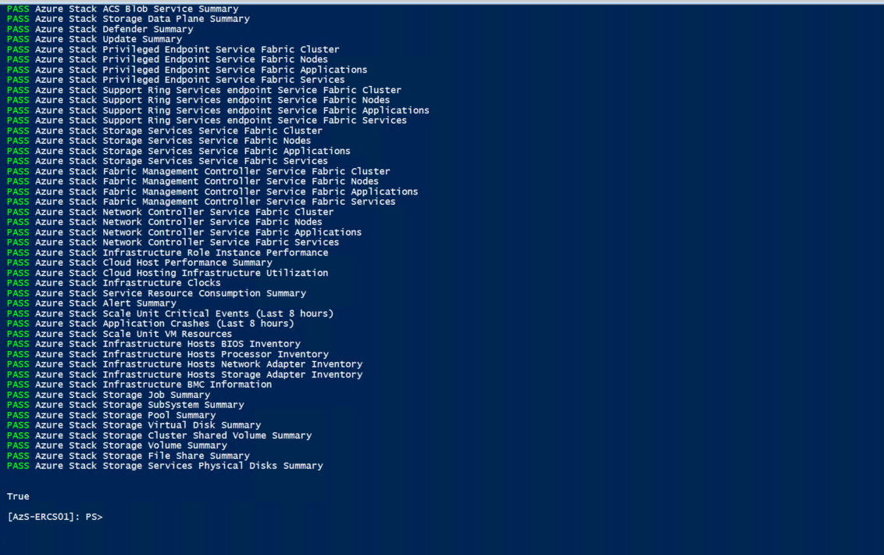
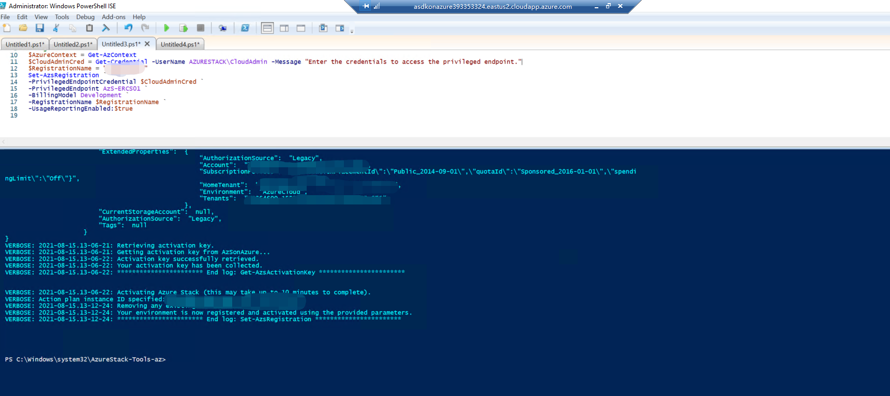
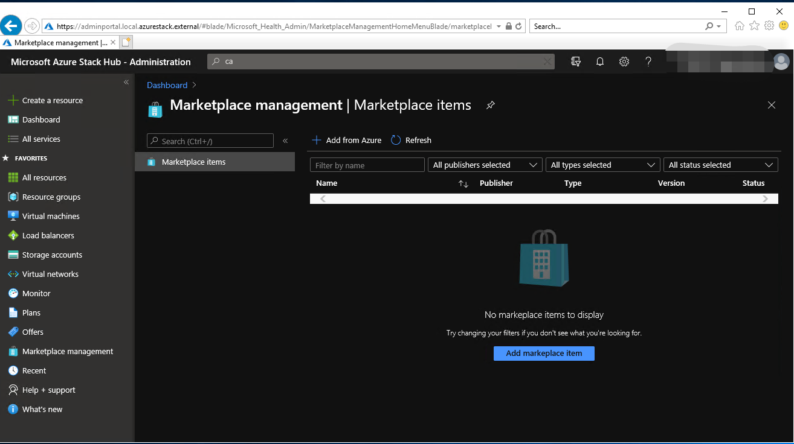
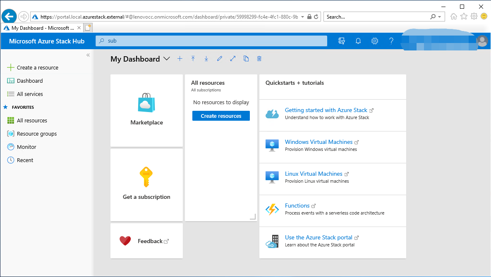

# Azure Stack on Azure
Creates new VM and install prerequisites for Azure Stack Hub Development kit (ASDK) to run Proof of Concept.

## Welcome to the Azure Stack Hub on Azure Step by Step Guide!
In this guide, we'll walk you experiencing a number of the amazing capabilities within Azure Stack Hub 2012.

## Description
Deploy-AzureStackonAzureVM.ps1 script prepares Storage Account and copy VHD file before you calling ARM Template

## Prepaire for the Deployment
* Gloabl Azure AD tenant with Gloabladmin permission


## Step by Step Guidance
### Step 1 - Download the Deploy-AzureStackonAzureVM.ps1 script

Run the following PowerShell command to install the new installation script. This will also downloads required modules from powershell gallery.

```powershell
Find-Script Deploy-AzureStackonAzureVM | Install-Module -Force
```

Can be run from Azure Cloudshell as well. :)

### Step 2 - Run the Deploy-AzureStackonAzureVM.ps1 script

Once script downloaded from PowerShell gallery, run the following command to locate some examples.

```powershell
Get-Help Deploy-AzureStackonAzureVM.ps1 -Examples
```

If your scenario does not require customization, simply run Deploy-AzureStackonAzureVM.ps1 without any parameters. if you provide any parameters, It will use default parameters and will prompt for local Administrator password for the new VM.

#### Example 1

```powershell
Deploy-AzureStackonAzureVM.ps1 -Verbose
```

#### Example 2

```powershell
Deploy-AzureStackonAzureVM -ResourceGroupName myResourceGroup -Region 'West Europe' -VirtualMachineSize 'Standard_E32s_v3'
```

Note: The execution of the script takes appoximately 20 mins or so. Please do NOT close the browser or cloudshell window during execution.

### Step 3 - Starting Azure Stack Hub deployment
Once the VM deployed logon to VM using 'Administrator' username and the password provided during the deployment. There are 3 shortcut on the desktop to start ASDK deployment;

* 'Install-ASDK' allow s you to select between ADFS based or AAD (Azure Ad)
* 'ADFS_Install-ASDK' for ADFS based deployment
* 'AAD_Install-ASDK' for Azure AD based deployment

**Note1**: After that, it takes about 10 hours to complete the setup and 310 steps :)) During this time, your VM may restart several times. But the installation will continue. If you want to monitor the deployment progress, sign in as azurestack\AzureStackAdmin after the ASDK host restarts.

**Note2**: The patch for the No scripts to "Install-ASDK"  "ADFS_Install-ASDK" "AAD_Install-ASDK"

1. Sign into AzS-HOST1 with "Administrator".
2. Create a post-config.ps1 and copy the text from here to it - https://raw.githubusercontent.com/yagmurs/AzureStack-VM-PoC/master/scripts/post-config.ps1
3. Run with

```powershell
.\post-config.ps1 -Username Administrator -Branch master -ASDKImage
```


## Install PowerShell commands for Azure Stack hub

You can install PowerShell commands for Azure Stack through the PowerShell Gallery.

```powershell
Set-PSRepository -Name "PSGallery" -InstallationPolicy Trusted
```

After that, you can install the latest Azure Stack PowerShell module to the ASDK host by running the commands below.

```powershell
[Net.ServicePointManager]::SecurityProtocol = [Net.SecurityProtocolType]::Tls12
 
Install-Module -Name Az.BootStrapper -Force -AllowPrerelease
Install-AzProfile -Profile 2019-03-01-hybrid -Force
Install-Module -Name AzureStack -RequiredVersion 2.0.2-preview -AllowPrerelease

Get-Module -Name "Az*" -ListAvailable
Get-Module -Name "Azs*" -ListAvailable
```

We can now configure a GitHub repository hosting PowerShell modules in the ASDK Host VM to manage resources and deploying them to Azure Stack. 

```powershell
# Download the tools archive.
invoke-webrequest `
  https://github.com/Azure/AzureStack-Tools/archive/az.zip `
  -OutFile az.zip
 
# Expand the downloaded files.
expand-archive az.zip `
  -DestinationPath . `
  -Force
 
# Change to the tools directory.
cd AzureStack-Tools-az
```

You can run the following commands to verify that your ASDK deployment is successful:

```powershell
Enter-PSSession -ComputerName AzS-ERCS01 -ConfigurationName PrivilegedEndpoint
Test-AzureStack
```



## Register AAD account for Azure Stack hub

As the last step in our ASDK configuration, you need to register your ASDK environment with Azure. This will allow you to use both Azure marketplace items and full features of Azure Stack. You can run the command below to register. Make sure to define your Azure Subscription ID and a uniqe-registration-name before running the command.
 
```powershell
Add-AzAccount -EnvironmentName "AzureCloud"
 
Register-AzResourceProvider -ProviderNamespace Microsoft.AzureStack
 
Import-Module C:\AzureStack-Tools-az\Registration\RegisterWithAzure.psm1
 
Get-AzSubscription -SubscriptionID "<strong><subscription ID></strong>" | Select-AzSubscription

# Register Azure Stack
$AzureContext = Get-AzContext
$CloudAdminCred = Get-Credential -UserName AZURESTACK\CloudAdmin -Message "Enter the credentials to access the privileged endpoint."
$RegistrationName = "<strong><unique-registration-name></strong>"
Set-AzsRegistration `
-PrivilegedEndpointCredential $CloudAdminCred `
-PrivilegedEndpoint AzS-ERCS01 `
-BillingModel Development `
-RegistrationName $RegistrationName `
-UsageReportingEnabled:$true
 ```

After the command runs successfully, you will see the message that your environment has been successfully registered to Azure. :smile:



After everything is completed, you can connect to https://adminportal.local.azurestack.external to the admin portal, and you can control the user portal by connecting to https://portal.local.azurestack.external.





We will go into the details of the configuration in our next articles on Azure Stack Hub.

References:
> Yağmur Şahin GitHub: https://github.com/yagmurs/AzureStack-VM-PoC
>
> Azure Docs: https://docs.microsoft.com/en-us/azure-stack/asdk/?view=azs-2008
>
> DevCloudOps: https://www.devcloudops.com/2020/12/16/azure-stack-hub-development-kit-asdk-installation-and-configuration-on-azure-vm/
